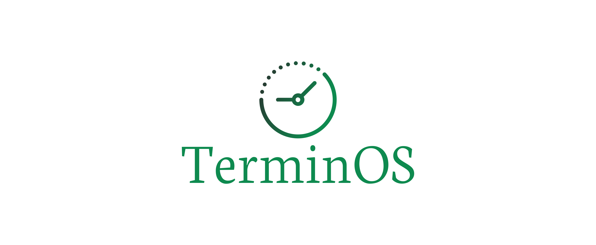
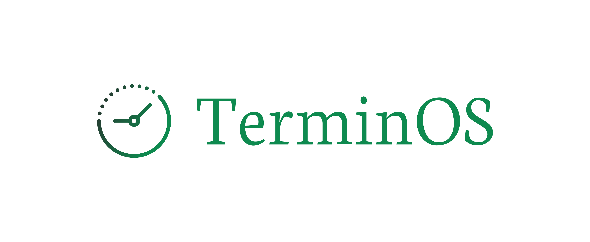

# logo
TerminOS

# Font

        Font in use <a target="_blank" href="https://fonts.google.com/specimen/Tenor+Sans">TenorSans-Regular</a> designed by
        <a target="_blank" href="https://www.behance.net/Denis_Masharov">Denis Masharov</a>
        and licensed under
        <a target="_blank" href="http://scripts.sil.org/cms/scripts/page.php?site_id=nrsi&amp;id=OFL_web">Open Font License.</a>
          Icon Designed by
          <a target="_blank" href="https://thenounproject.com/grega.cresnar">Gregor Cresnar</a>

# Colors
+

Font
        #BA6716

Background
        #FFFFFF

Icon

        #FFA246
        #732107

### css 
    p {
       font-family: 'HKGroteskRegular';
       font-weight: normal;
       font-style: normal;
    }

### html

    <link rel="stylesheet" media="screen" href="https://fontlibrary.org/face/hk-grotesk" type="text/css"/>
    
    
# Logo

## 1

## 2

## 3

## 4

